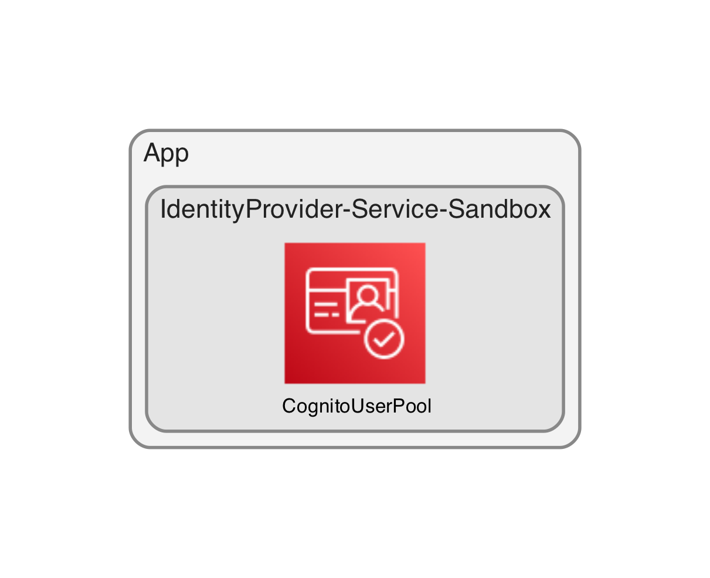

# Identity Provider
Creates identity store and UI app client.



\* Diagram generated using https://github.com/pistazie/cdk-dia

## Create development environment
See [Getting Started With the AWS CDK](https://docs.aws.amazon.com/cdk/latest/guide/getting_started.html) for additional details and prerequisites.

### Clone the code
```bash
git clone https://github.com/applicationdesignframework/identity-provider
cd identity-provider
```

### Create Python virtual environment and install the dependencies
```bash
python3.9 -m venv .venv
source .venv/bin/activate

# [Optional] Needed to upgrade dependencies and cleanup unused packages
# Pinning pip-tools to 6.4.0 and pip to 21.3.1 due to
# https://github.com/jazzband/pip-tools/issues/1576
pip install pip-tools==6.4.0
pip install pip==21.3.1

./toolchain/install-deps.sh
./toolchain/run-tests.sh
```

### [Optional] Upgrade AWS CDK CLI version
```bash
vi package.json  # Upgrade the "aws-cdk" package version
./toolchain/install-deps.sh
./toolchain/run-tests.sh
```

### [Optional] Upgrade dependencies (ordered by constraints)

Consider [AWS CDK CLI](https://docs.aws.amazon.com/cdk/v2/guide/versioning.html#cdk_toolkit_versioning) compatibility when upgrading AWS CDK library version.

```bash
pip-compile --upgrade requirements.in
pip-compile --upgrade requirements-dev.in
./toolchain/install-deps.sh
# [Optional] Cleanup unused packages
pip-sync requirements.txt requirements-dev.txt
./toolchain/run-tests.sh
```

## Deploy the service to sandbox environment
The `IdentityProvider-Service-Sandbox` stack uses your default AWS account and Region.

```bash
npx cdk deploy IdentityProvider-Service-Sandbox
```

Example output:
```
 ✅  IdentityProvider-Service-Sandbox

Outputs:
IdentityProvider-Service-Sandbox.CognitoUserPoolID = eu-west-1_W2c...
IdentityProvider-Service-Sandbox.UIAppSignInURL = https://111111111111-example.auth.eu-west-1.amazoncognito.com/login?client_id=5r2jp...&response_type=token&redirect_uri=https://ui.eu-west-1.111111111111.product.example.com
```

## Test the service

### Create a test user
The identity provider requires `custom:tenant_id` and `custom:role` attributes.
```bash
_user_email="YOUR_EMAIL"
_user_tenant_id="YOUR_TENANT_ID"
_user_role="YOUR_ROLE"
```
```bash
_user_pool_id=$(aws cloudformation describe-stacks \
  --stack-name IdentityProvider-Service-Sandbox \
  --query 'Stacks[*].Outputs[?OutputKey==`CognitoUserPoolID`].OutputValue' \
  --output text)

aws cognito-idp admin-create-user \
  --user-pool-id ${_user_pool_id} \
  --username ${_user_email} \
  --user-attributes \
    Name=email,Value=${_user_email} \
    Name=email_verified,Value=True \
    Name=custom:tenant_id,Value=${_user_tenant_id} \
    Name=custom:role,Value=${_user_role}
```
You should get an email with a temporary password from `no-reply@verificationemail.com`.

### Sign in
```bash
open $(aws cloudformation describe-stacks \
  --stack-name IdentityProvider-Service-Sandbox \
  --query 'Stacks[*].Outputs[?OutputKey==`UIAppSignInURL`].OutputValue' \
  --output text)
```

You will need to change the temporary password. 

The identity provider redirects the browser to UI app URL with `id_token`, `expires_in`,
and `token_type` parameters. The UI app URL looks like this:
```
https://ui.eu-west-1.111111111111.product.example.com/#id_token=eyJ...&expires_in=3600&token_type=Bearer
```

You can use https://jwt.io/#debugger-io to introspect the ID token. Example payload:
```json
{
  "at_hash": "o3bVzE71u9zKbMrvKrXqWA",
  "sub": "7a9d788a-2618-44d7-a3eb-1d904364f531",
  "email_verified": true,
  "iss": "https://cognito-idp.eu-west-1.amazonaws.com/eu-west-1_W2c...",
  "cognito:username": "7a9d788a-2618-44d7-a3eb-1d904364f531",
  "custom:tenant_id": "Yellow",
  "aud": "5r2jpndilests3epmc8idtfenu",
  "event_id": "e5bf0638-6d30-4429-b3a7-7cc3b67b250d",
  "token_use": "id",
  "auth_time": 1678953616,
  "exp": 1678957216,
  "custom:role": "Admin",
  "iat": 1678953616,
  "jti": "0e96bc82-e79b-4df2-90ab-4e29c275f5a0",
  "email": "user@example.com"
}
```

### Delete the user
```bash
aws cognito-idp admin-delete-user \
  --user-pool-id ${_user_pool_id} \
  --username ${_user_email}
```

## Delete the service
**Do not forget to delete the stack to avoid unexpected charges**
```bash
npx cdk destroy IdentityProvider-Service-Sandbox
```
